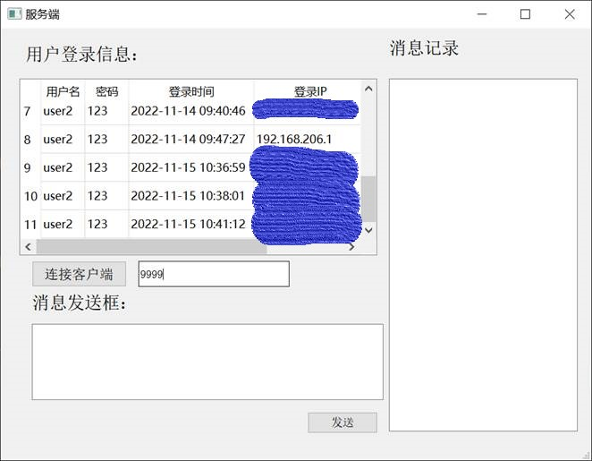
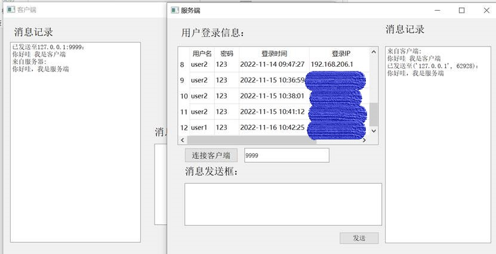

# :computer: 基于 Python 和 pyqt5 的通信应用

本项目使用 Python 3.9.7 和 pyqt5 进行开发，使用 MySQL 存储数据文件。通过登录界面进行用户验证，验证成功后可以使用通信服务与服务端进行实时通信。

## :hammer_and_wrench: 开发环境和工具

- Python 3.9.7
- Windows 10
- MySQL 5.5
- Navicat
- pyqt5

## :briefcase: 简要概述

用户通过登录界面进行登录操作，当通过验证之后，用户的登录信息被记录至数据库中的 `login_info` 表格中，服务端可对其进行读取并且显示。当用户通过登录验证后，即可跳转到通信界面并且使用通信服务，此服务可与服务端进行实时通信。

## :clipboard: 功能分析和设计

用户登录验证：

- 客户端使用登录窗口，最多允许输入 3 次密码，密码正确后才能打开通信窗口进行通信。
- 客户端登录时，如果 3 次密码错误，则密码锁定，当天不能再次进行登录。

实时通信：

- 客户端通过验证后，即可跳转到通信界面并使用通信服务。
- 客户端和服务端之间可以进行实时通信。


数据库中有两个表格：

- `user`：用户的基本数据存储表，包括用户账户、密码、登录失败次数、是否被封禁和解封时间。
- `login_info`：用户每次登录时的登录信息记录表，包括用户的账号、密码、何时登录和登录时的 IP 地址。


代码核心文件:

- `chartClientLogic`
- `chatServerLogic`
- `client`
- `login_logic`
- `mainLogin`
- `server`

这些文件之间的类关系如下所示：


`Ui_MainWindow`、`client_MainWindow`、`server_MainWindow` 分别为登录界面、客户端通信界面、服务端界面。`loginLogic` 负责用户验证，`chatClient` 为客户端的通信服务，`chatServer` 为服务端的通信服务。

## :file_folder: 目录结构

```
├── files
├── chartClientLogic.py
├── chatServerLogic.py
├── client.py
├── login_logic.py
├── main.py
├── mainLogin.py
├── README.md
├── requirements.txt
└── server.py
```

## :rocket: 快速开始

1. 下载代码：

   ```bash
   git clone https://github.com/yourusername/yourproject.git
   ```

2. 安装依赖：

   ```bash
   pip install -r requirements.txt
   ```

3. 运行服务端：

   ```bash
   python server.py
   ```

4. 运行登录界面端：

   ```bash
   python main.py
   ```

## :computer:程序截图

用户登录界面：


 

登录验证流程：


账号密码有一项没填则提示输入账号或密码。

 

账号不存在的情况：


密码错误的情况：


密码输错三次的情况则会封禁一天，无法登录：


 

登录成功的情况：


点击ok则跳转至客户端界面

 

客户端界面：


客户端左边为聊天记录，通过消息发送框编辑的内容，按“发送”即可与服务端进行通信。

 

服务端界面：



包括绑定的端口和所有用户的登录信息，服务端监听端口9999，客户端的连接端口默认设置为9999。服务端右边为聊天记录，通过消息发送框编辑的内容，按“发送”即可与客户端进行通信。

 

服务端和客户端实现消息互通：



通过信息的发送，可以实现两者的通信，并且有对应的位置信息和聊天信息的记录。

## :warning:注意

**开启server之后，记得对9999端口进行监听。等待登录成功，才可跳转至客户端。**

## :clipboard:参考资料

https://github.com/zengbolin/pyqt5_python-

https://github.com/GGL12/FaceCollect

https://github.com/Wangler2333/tcp_udp_web_tools-pyqt5

https://github.com/INDEXxiaoxia/chat-view-pyqt5

https://github.com/taseikyo/PyQt5-Apps

## :page_facing_up: 许可证

本项目采用 MIT 许可证进行许可。